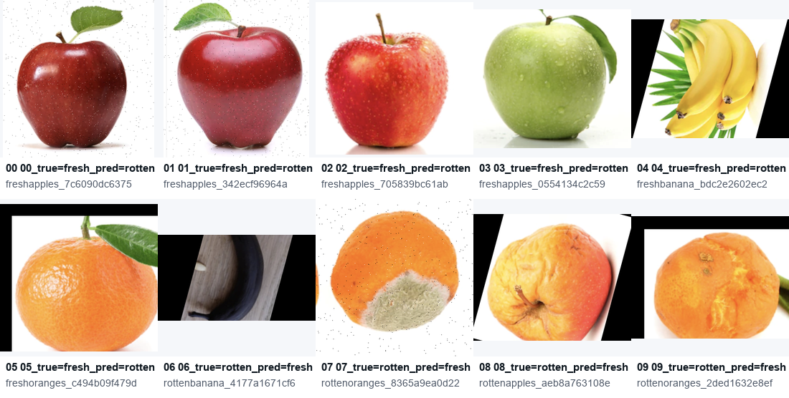

# Analise de erros - Random Forest

Esta analise usa os erros do modelo Random Forest no conjunto de teste. A pasta com as imagens esta em `outputs/erros/random_forest/`, e a prancha visual esta em `outputs/figuras/analise_erros/erros_random_forest_prancha.png`.

## Resumo

O modelo errou exemplos dos dois tipos:

- Falsos positivos: frutas `fresh` classificadas como `rotten`.
- Falsos negativos: frutas `rotten` classificadas como `fresh`.

Na rodada demonstrativa, os erros aparecem principalmente quando brilho, textura, manchas naturais, fundo preto/rotacionado ou deterioracao localizada alteram as features manuais de cor, textura e forma. Isso e coerente com um pipeline classico: ele depende muito da qualidade da segmentacao e de estatisticas globais da regiao segmentada.

## Prancha visual

## Hipoteses por imagem

| # | Imagem | Real | Predito | Hipotese do erro |
|---:|---|---|---|---|
| 00 | `freshapples_7c6090dc6375.png` | fresh | rotten | A maca fresca tem regiao vermelha muito escura, sombra inferior e muitos pontos na casca. Esses sinais podem aumentar contraste/textura e aproximar a amostra do padrao visual de deterioracao. |
| 01 | `freshapples_342ecf96964a.png` | fresh | rotten | O forte brilho especular e a variacao entre areas claras e escuras podem distorcer as medias/desvios de cor e as features de textura, fazendo a fruta parecer irregular. |
| 02 | `freshapples_705839bc61ab.png` | fresh | rotten | A casca apresenta textura granular e variacao amarela/vermelha intensa. O modelo pode ter interpretado essa heterogeneidade como mancha ou inicio de deterioracao. |
| 03 | `freshapples_0554134c2c59.png` | fresh | rotten | A maca verde tem cor diferente do padrao dominante de frutas frescas vermelhas no subconjunto. Como as features de cor sao fortes no modelo, essa mudanca de tonalidade pode ter deslocado a amostra para a classe errada. |
| 04 | `freshbanana_bdc2e2602ec2.png` | fresh | rotten | A banana tem pontas escuras e fundo preto nas bordas devido a rotacao/recorte. Esses elementos podem afetar a segmentacao e introduzir regioes escuras associadas a podridao. |
| 05 | `freshoranges_c494b09f479d.png` | fresh | rotten | A laranja fresca tem textura de casca muito marcada, brilho localizado e uma faixa preta no topo. Isso pode aumentar contraste e alterar as features de textura e forma. |
| 06 | `rottenbanana_4177a1671cf6.png` | rotten | fresh | A banana esta muito escura, mas a regiao util parece estreita e parcialmente confundida com fundo/sombra. A mascara pode ter capturado uma area pouco representativa, reduzindo os sinais de deterioracao nas features globais. |
| 07 | `rottenoranges_8365a9ea0d22.png` | rotten | fresh | A deterioracao esta concentrada em uma mancha clara/localizada. Como o vetor usa estatisticas agregadas, a parte ainda alaranjada pode dominar a media de cor e suavizar o indicio de podridao. |
| 08 | `rottenapples_aeb8a763108e.png` | rotten | fresh | A imagem tem fundo preto nas laterais e fruta rotacionada. A falha de recorte/segmentacao pode ter alterado forma e cor, enquanto a parte visivel da fruta ainda mantem tons semelhantes aos de uma maca aceitavel. |
| 09 | `rottenoranges_2ded1632e8ef.png` | rotten | fresh | A laranja tem manchas e enrugamento, mas grande parte da superficie continua com cor laranja forte. As features globais de cor podem ter pesado mais que os sinais locais de textura deteriorada. |

## Leitura critica

Os erros sugerem que o pipeline classico funciona bem para diferencas globais de cor e textura, mas tem dificuldade quando o defeito e pequeno, localizado ou misturado com variacoes normais da fruta. Tambem ha sensibilidade a fundo preto, rotacao, sombra e brilho.

Melhorias provaveis:

1. Refinar a segmentacao para remover bordas pretas e fundo residual.
2. Adicionar features locais por regioes da fruta, em vez de usar apenas estatisticas globais.
3. Fazer ablation study para medir separadamente o impacto de cor, textura e forma.
4. Aumentar a diversidade balanceada de exemplos por tipo de fruta.
5. Testar robustez com imagens novas e condicoes de iluminacao diferentes.
